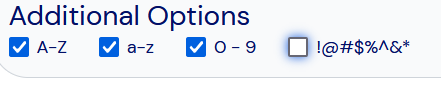

# Squire Workshop

Squire Workshop is a web application that helps people manage their role-playing characters.

The Squire community is what has made this app everything that it is. I started Squire as an Android application back in 2015 and listened to my users. With their suggestions, Squire expanded its feature set and became a robust tool. In 2020 Squire was converted into a web application and has continued to grow. Because of how much the community cares about Squire's success, I have decided to make my life's work open source. Please be respectful of other's commits and I can't wait to see what everyone can contribute to this project. Thanks for all of your support.

# Setup (Docker Compose)

We put a lot of work into automating most of the setup to enable you to run it either on your local machine, or as a real server accessible to many users.

This is the easiest way to get Squire Workshop up and running, and includes 4 main components:
* The frontend
* The backend
* The database
* A reverse proxy (to handle SSL and routing)

### Missing Features
 This setup does not include an email server. Therefore, all email related features won't work out of the box (like e.g. sending password reset emails). If you want to use these features, you will need to add an email server and the correct config yourself, based on [the manual setup](#setup-manual).

 Maybe at some point we will add this into the docker-compose setup as well. If you want to help with that, feel free to contribute!

## 1. Prerequisites

### For Deployment
Download/Copy the following files from this repository:
* [docker-compose.yml](docker-compose.yml)
* [docker-compose.config.yml](docker-compose.config.yml) - for your secret values, more info on that [below](#configuration)
* [docker-compose.local.yml](docker-compose.local.yml) - for local deployment on your machine
* [docker-compose.deploy.yml](docker-compose.deploy.yml) - for deployment on a server that is reachable from the internet

Put them in a single folder where you want to keep your configuration files.

You do not need _any_ other files from this repository for deployment.
Continue with the [configuration section](#configuration) below.

### For Local Development
Pull this entire repository to your local machine [using git](https://docs.github.com/en/repositories/creating-and-managing-repositories/cloning-a-repository). 

## 2. Configuration
_You will need this for deployment as well as local development._

The configuration has been abstracted as much as possible. There is a single file you need to adjust with your secret values: [docker-compose.config.yml](docker-compose.config.yml).

There are three values you _need_ to replace, which are marked as `YOUR_SECRET_HERE` in the file.

There is also a value you _can_ replace to change behavior, such as `SQUIRE_ALLOW_SIGNUP`.

Beware: If any of your secrets include `$` characters, you need to replace them with something else, as docker-compose will interpret them as environment variables.
E.g. `aB$xZy` -> `aBOxZy`

The easiest way to prevent this is to use a [password generator](https://bitwarden.com/password-generator/) to generate the secrets and disable the use of special characters, which could look like this:



### 1. MYSQL_PASSWORD

Recommended length: 128

Generate a long random string. This will be the password for the MySQL user the backend uses.

e.g. `nxfjFBfiSLXqQxaaBQBMhekiBSr3PHokq46uEqH6X2LUKGiDUbVLYj4Z7WKLzoRcNKsPQWvzkzsk2n5f6JVGaqE2hbqq6yenSadWZte7P7pR4CenEGvmznz9R6YmaZMz` ( do NOT use this example value! )

### 2. SQUIRE_JWT_SECRET

Recommended length: 128

Generate a long random string. This will be the secret the backend uses to create safe credentials/access tokens for users.

e.g. `N5d5txwScDDSctJTukfS6A3pcmU7r7xmA7Hj3jmy3jjk2DrNyGXPTkZ5JKi7nmbN2gHvKwMGS8y4iTdAXDZxtnZt75dcMXHtT5WJWnpZkSarKDyCfy8XSc7sS7G5xn4Z` ( do NOT use this example value! )

### 3. SQUIRE_ID_SECRET

Recommended length: 32

Required length: 16, 24 or 32

Generate a random string of specified length. This is another secret the backend will use for cryptography. 

e.g. `p8R9hywhFJeLcbHp4sxyYx9SP7bjUDMu` ( do NOT use this example value! )

### 4. SQUIRE_ALLOW_SIGNUP

To enable you to block users from signing up unless you want them to, there is a setting to disable signups entirely. The idea is that you enable it, let your friends sign up, and then disable it again.

Remember to restart the service after you change the config to make the change take effect. More on restarting the service [below](#running-the-application).

Value to enable signups: `"true"`

Value to disable signups: `"false"`

### Example result
Using above examples values, the outcome of the docker-compose.config.yml file should look something like this:
```diff
version: '3.4'
# For ANY values you add here, make sure they do NOT include "$".
# If you created a random string, just replace it with another character of your choice.

x-common-variables: &common-variables
  # The password for the MySQL database user. Choose a long random string.
-  MYSQL_PASSWORD: YOUR_SECRET_HERE
+  MYSQL_PASSWORD: nxfjFBfiSLXqQxaaBQBMhekiBSr3PHokq46uEqH6X2LUKGiDUbVLYj4Z7WKLzoRcNKsPQWvzkzsk2n5f6JVGaqE2hbqq6yenSadWZte7P7pR4CenEGvmznz9R6YmaZMz

services:
  backend:
    environment:
      <<: *common-variables
      # Choose a long random string for the JWT secret.
-      SQUIRE_JWT_SECRET: YOUR_SECRET_HERE
+      SQUIRE_JWT_SECRET: N5d5txwScDDSctJTukfS6A3pcmU7r7xmA7Hj3jmy3jjk2DrNyGXPTkZ5JKi7nmbN2gHvKwMGS8y4iTdAXDZxtnZt75dcMXHtT5WJWnpZkSarKDyCfy8XSc7sS7G5xn4Z
      # Choose a random string of the length 16, 24 or 32 for the ID secret.
-      SQUIRE_ID_SECRET: YOUR_SECRET_HERE
+      SQUIRE_ID_SECRET: p8R9hywhFJeLcbHp4sxyYx9SP7bjUDMu

      # Whether to allow creation of new user accounts
      # To disable signups, set this to 'false'
-      SQUIRE_ALLOW_SIGNUP: 'true'
+      SQUIRE_ALLOW_SIGNUP: 'false'

      # Values required for email communication.
      # TODO: add an email server to the docker compose.
      # Right now all email related featues wont work.
      # Therefore you can leave them as-is.
      SQUIRE_BASE_URL: http://localhost/
      SQUIRE_EMAIL_ADDRESS: test@gmail.com
      SQUIRE_EMAIL_PASSWORD: email_password
      SQUIRE_NOTIFY_EMAIL_ADDRESS: test@gmail.com
  database:
    environment:
      <<: *common-variables
```

### Additional Changes for Server Deployment
If you are deploying the application to a server that is reachable from the internet, you will need to adjust the [docker-compose.deploy.yml](docker-compose.deploy.yml) file to include your domain.

Make sure that you own a domain pointing to your server's IP address.

Replace `your-domain.com` with your actual domain wherever it occurs. Assuming you have a domain `your-actual-domain.com`, the changes would look like this:

```diff
version: '3.4'
services:
  traefik:
    command:
      - '--providers.docker=true'
      - '--providers.docker.exposedbydefault=false'
      - '--entrypoints.websecure.address=:443'
      - '--certificatesresolvers.default.acme.tlschallenge=true'
      - '--certificatesresolvers.default.acme.storage=/letsencrypt/acme.json'
      # change the email address to your own
-      - '--certificatesresolvers.default.acme.email=owner@your-domain.com'
+      - '--certificatesresolvers.default.acme.email=owner@your-actual-domain.com'
    ports:
      - '443:443'
    volumes:
      - 'letsencrypt:/letsencrypt'
  frontend:
    labels:
      # The domain and path the service will respond on, change this to your domain
-      - 'traefik.http.routers.frontend.rule=Host(`your-domain.com`) && PathPrefix(`/`)'
+      - 'traefik.http.routers.frontend.rule=Host(`your-actual-domain.com`) && PathPrefix(`/`)'
      - 'traefik.http.routers.frontend.entrypoints=websecure'
      - 'traefik.http.routers.frontend.tls.certresolver=default'
  backend:
    labels:
      # The domain the service will respond to, change this to your domain
-      - 'traefik.http.routers.frontend.rule=Host(`your-domain.com`) && PathPrefix(`/api`)'
+      - 'traefik.http.routers.frontend.rule=Host(`your-actual-domain.com`) && PathPrefix(`/api`)'
      - 'traefik.http.routers.frontend.entrypoints=websecure'
      - 'traefik.http.routers.frontend.tls.certresolver=default'
volumes:
  letsencrypt:
```

## 3. Running the application

### Prerequisites
Install Docker on your machine. An easy way to do this is by using [Docker Desktop](https://docs.docker.com/get-docker/), but you could also use [other tools or methods](https://docs.docker.com/engine/install/).

#### Log in to the GitHub Container Registry (required for deployment)
To be able to pull images from GitHubs container registry (where the official squire images reside), you need to log in using your GitHub account.

You can find a detailed guide on how to do this [here](https://docs.github.com/en/packages/working-with-a-github-packages-registry/working-with-the-container-registry#authenticating-with-a-personal-access-token-classic).

The TL;DR is:
Create a personal access token with the `read:packages` scope on https://github.com/settings/tokens and use it to log into the GitHub Container Registry with the following command:
```
echo YOUR_TOKEN | docker login ghcr.io -u YOUR_GITHUB_USERNAME --password-stdin
```

### Deployment

Choose one of the following, depending on your use case.

In all cases you will need to navigate to the folder where your docker-compose files are located and open your terminal there. If you are not sure how to do that, [here is a guide](https://realpython.com/terminal-commands/#install-and-open-the-terminal).

#### Local Deployment
This is used to start the application on your local machine, and it will be accessible at `http://localhost/`.

Run
```
docker compose -f docker-compose.yml -f docker-compose.local.yml up -d
```
to download all required services and start the application.

Once finished, it will continue running in the background. You can stop it with `docker compose -f docker-compose.yml -f docker-compose.local.yml down` and start it again with `docker compose -f docker-compose.yml -f docker-compose.local.yml up -d` at any time.

#### Server Deployment
This is used start the application on a server that is reachable from the internet. It will be accessible at `https://your-domain.com/`.

Make sure you applied the [additional changes for server deployment](#additional-changes-for-server-deployment) to your `docker-compose.deploy.yml` file.

Run
```
docker compose -f docker-compose.yml -f docker-compose.deploy.yml up -d
```
to download all required services and start the application.

Once finished, it will continue running in the background. You can stop it with `docker compose -f docker-compose.yml -f docker-compose.deploy.yml down` and start it again with `docker compose -f docker-compose.yml -f docker-compose.deploy.yml up -d` at any time.

### Local Development
To test any of the changes you made, you can use the local development setup. This will build the images from your local files and start the application on your local machine at `http://localhost/`.

Run
```
docker compose -f docker-compose.yml -f docker-compose.development.yml up -d --build
```
to build the images from your local files and start the application.

Once finished, it will continue running in the background. You can stop it with `docker compose -f docker-compose.yml -f docker-compose.development.yml down`.

Whenever you want to test new changes, stop the containers and run the command again to rebuild the images with your changes.

# Setup (manual)

You don't need to use docker compose, you can also do everything manually. This gives you more control over the setup, but also requires more work.

## Installation
* Perform the database installation. Refer to the README in the `/squire-workshop/database` directory.
* Perform the backend installation. Refer to the README in the `/squire-workshop/backend` directory.
* Perform the frontend installation. Refer to the README in the `/squire-workshop/frontend` directory.

## Deployment
If you are looking to deploy the code to a dedicated server, follow the steps listed in the README in the `/squire-workshop/scripts` directory.

# Contributing
The Squire community continues to amaze me with all of their suggestions. If you have any ideas that you would like to share, please fork the repo and create a pull request. You can also create an issue with the tag "enhancement".

* Fork the Project
* Create your Feature Branch (git checkout -b feature/feature_name)
* Commit your Changes (git commit -m 'meaningful commit message')
* Push to the Branch (git push origin feature/feature_name)
* Open a Pull Request

# License
Distributed under the GPL3 License. See LICENSE.txt for more information.

# Contact
Shane Herd - shane.herd@squireworkshop.com
